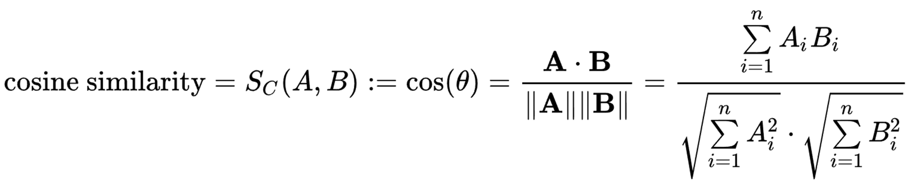
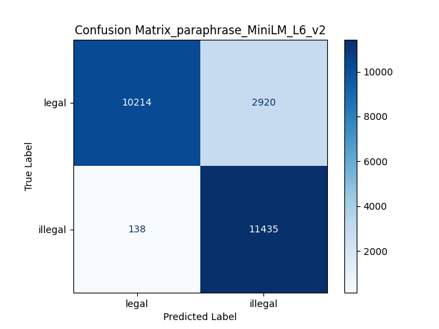
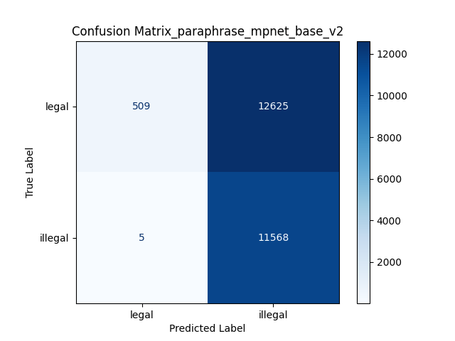
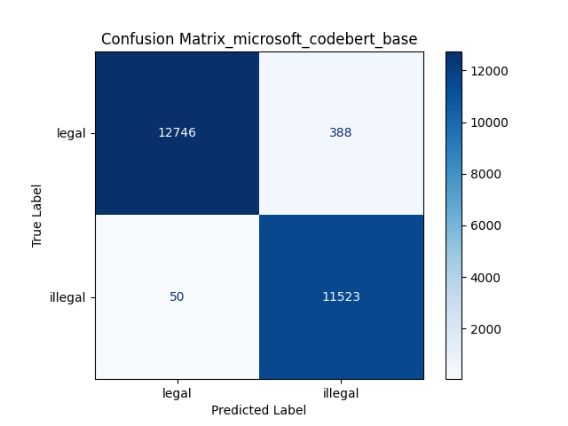
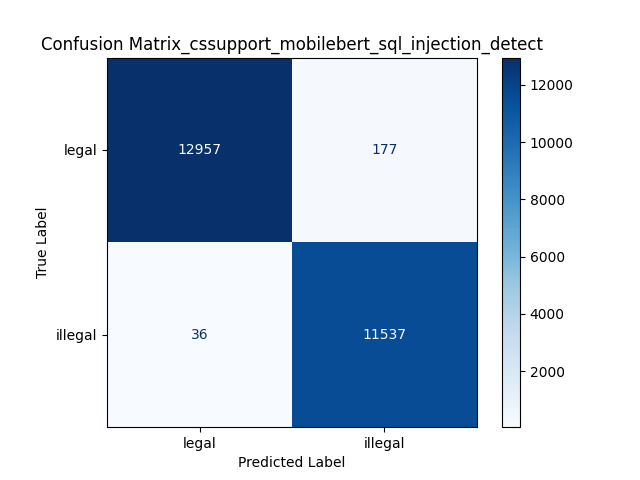
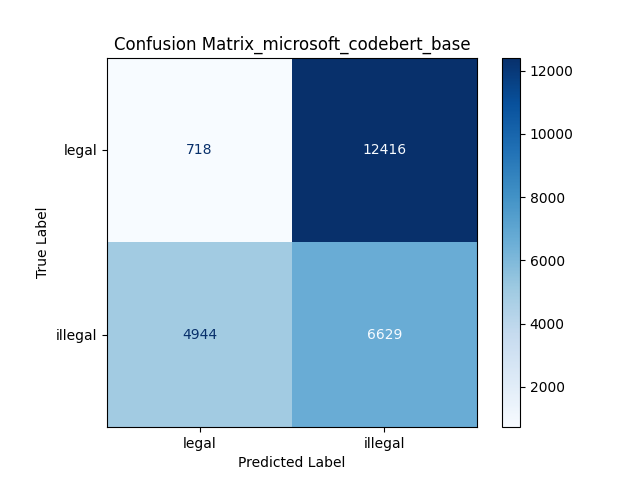

| 步驟 | 內容 |
| --- | --- |
| 1. 資料準備 | 清理數據，提取 SQL 語句與標籤，構造結構化數據集。 |
| 2. 向量資料庫構建 | 使用 Sentence-BERT 將語句轉換為向量，建立 FAISS 向量檢索庫。 |
| 3. 合法性檢測 | 輸入語句後向量化，檢索最相關內容，返回標籤作為判斷結果。 |
| 4. 系統整合 | 整合檢索與判斷邏輯，封裝為 API 或終端應用，支持輸入和輸出。 |
| 5. 測試與優化 | 使用測試集檢測準確率，調整檢索參數和優化分類性能。 |
| 6. 部署與監控 | 部署到服務器，配置日誌和異常監控以確保穩定運行。 |

資料來源

執行程式

產生的數據及資料
```
retrieval_system/
├── 1_preprocess_data/
│   └── dataset_preprocessor.py
├── 2_construct_vector_database/
│   ├── convert_queries_to_vectors.py
│   └── convert_queries_to_vectors_bert.py
├── 3_vector_retrieval/
│   ├── vector_inference_with_timer.py
│   ├── vector_single_query_classifier.py
│   └── vector_batch_query_evaluator.py
└── 4_direct_classification/
    ├── direct_inference_with_timer.py
    ├── direct_single_query_classifier.py
    └── direct_batch_query_evaluator.py
```
## 1. 資料準備

### 1.1 清洗與格式化數據

D:\RAG\SQL_legality\dataset\trainingdata.csv

- 目標：
    - 從原始數據中提取 SQL 語句和標籤。
    - 刪除冗餘信息（如非 SQL 的長文本）。
- 步驟：
    - 篩選數據集中 Query 列，保留純 SQL 語句。
    - 確保每條語句對應一個標籤（合法 0 / 非法 1）。
- 結果：
    - 生成清理後的 CSV 文件或結構化數據集，格式如下：

```
Query, Label
SELECT * FROM users WHERE id = 1;, 0
select pg_sleep(5);, 1
```

### 1.2 切分語句

- 目標：
    - 將每條語句分別向量化，保證可以高效檢索。
- 方法：
    - 使用 NLP 工具（如 Sentence-BERT）將每條 SQL 語句轉換為嵌入向量。

D:\RAG\SQL_legality\retrieval_system\1_preprocess_data\dataset_preprocessor.py

產生 D:\RAG\SQL_legality\dataset\processed_labels.txt

   D:\RAG\SQL_legality\dataset\processed_queries.txt

## 2. 向量資料庫構建

### 2.1 建構向量化語句資料

D:\RAG\SQL_legality\retrieval_system\2_construct_vector_database\convert_queries_to_vectors.py

- 使用嵌入模型（如 `Sentence-BERT`）計算數據集中每一條語句的嵌入向量。
- 每條語句的向量是固定維度（`'word_embedding_dimension': 384,`）的數組，代表該語句的語義。

例如：

- SQL 語句：`"SELECT * FROM users WHERE id = 1;"`
- 嵌入向量（示例）：`[0.123, 0.456, -0.789, ..., 0.001]`。

```python
from sentence_transformers import SentenceTransformer

model = SentenceTransformer('paraphrase-MiniLM-L6-v2')
sql_queries = [
    "SELECT * FROM users WHERE id = 1;",
    "select pg_sleep(5);"
]
	embeddings = model.encode(sql_queries)
```

Hint：

安裝 faiss時 使用

```bash
conda install -c pytorch faiss-cpu
```

因為windows底下並不支援faiss-gpu

若是在Linux 或 WSL。可以使用

```bash
conda install -c pytorch faiss-gpu
```

儲存在 D:\RAG\SQL_legality\dataset\vector\{model_name}

D:\RAG\SQL_legality\dataset\vector\queries_{model_name}.npy

D:\RAG\SQL_legality\dataset\vector\vector_index_{model_name}.faiss

D:\RAG\SQL_legality\dataset\vector\vector_labels_{model_name}.npy

- `queries.npy`：存儲原始語句內容，方便後續檢索時還原。
- `vector_index.faiss`：存儲所有嵌入向量的索引。
- `vector_labels.npy`：存儲每條語句對應的標籤（如合法性標記）。

### 2.2 SQL 語句檢索

D:\RAG\SQL_legality\retrieval_system\2_construct_vector_database\query_similarity_search.py

1. 嵌入查詢語句：
- 使用與 2.1 相同的嵌入模型，將查詢語句轉換為嵌入向量。
1. 計算距離：
- 將查詢嵌入向量與索引中的所有向量逐一計算距離。
- 使用餘弦相似性 (Cosine similarity)衡量語句之間的相似性。

```python
faiss_index = faiss.IndexFlatIP(embedding_dimension)
```

Cosine similarity 距離公式

距離的計算公式為：



- 距離範圍[-1~1]
- 距離越小：
    - 表示查詢語句與索引語句的語義越相似。
- 距離越大：
    - 表示查詢語句與索引語句的語義差異越大。

### 2.3 示例計算

## 3. SQL 合法性檢測

### 3.1 單筆SQL語句檢索

D:\RAG\SQL_legality\retrieval_system\3_sql_legality_retrieval\single_sql_legality_classifier.py

```python
user_query = "SELECT * FROM earnings;" # 合法語句
```

```python
正在使用 paraphrase-MiniLM-L6-v2 模型進行分類...
加載模型 paraphrase-MiniLM-L6-v2 的向量資料...
向量索引中包含 98275 條語句。
輸入語句: SELECT * FROM earnings;
尋找符合threshold > 0.80，最近的 5 個語句。
未找到符合閾值的結果，降低相似度閾值到 0.80 ~ 0.70 ...

判斷結果：
輸入語句: SELECT * FROM earnings;
語句合法性：legal合法語句
原因：基於加權結果，標籤加權分數 {0: 2.7422583039741104, 1: 0}

詳細信息：
第 1 筆：
  - 索引: 97839
  - 標籤: 0
  - 距離: 0.7527
  - 原始語句: select * from purchase;
第 2 筆：
  - 索引: 97862
  - 標籤: 0
  - 距離: 0.7074
  - 原始語句: select count(*) from purchase;
3.1 單筆SQL語句檢索完成，使用模型: paraphrase-MiniLM-L6-v2！
```

### 3.2 單筆SQL輸入檢索推論

加入time函數及模擬使用者單筆SQL輸入查詢

```python
user_query = input("請輸入SQL語句 (或輸入 'exit' 結束): ")
```

D:\RAG\SQL_legality\retrieval_system\3_sql_legality_retrieval\inference_sql_legality.py

```python
正在使用 paraphrase-MiniLM-L6-v2 模型進行分類...
加載模型 paraphrase-MiniLM-L6-v2 的向量資料...
向量索引中包含 98275 條語句。
請輸入SQL語句 (或輸入 'exit' 結束): SELECT * FROM earnings;

輸入語句: SELECT * FROM earnings;

尋找符合threshold > 0.80，最近的 5 個語句。
未找到符合threshold>0.80 的結果，降低相似度閾值到 0.80 ~ 0.70 ...

檢索詳細信息：
第 1 筆：
  - 索引: 97839
  - 標籤: 0
  - 距離: 0.753
  - 原始語句: select * from purchase;
第 2 筆：
  - 索引: 97862
  - 標籤: 0
  - 距離: 0.707
  - 原始語句: select count(*) from purchase;

推論時間: 31.7489 ms

判斷結果：
輸入語句: SELECT * FROM earnings;
語句合法性：legal合法語句
原因：基於加權結果，標籤加權分數 {0: 2.7423, 1: 0.0000}
推論時間: 31.7489 ms
3.2 SQL 語句合法性判斷完成，使用模型: paraphrase-MiniLM-L6-v2！
```

### 3.3 多筆資料檢索

D:\RAG\SQL_legality\retrieval_system\3_sql_legality_retrieval\testing_sql_legality_classifier.py

可以讀取多筆資料並且查詢，生成混淆矩陣。

| Accuracy | Precision | Recall |
| --- | --- | --- |
| 87.623% | 79.659% | 98.808% |

運行時間9分14秒




| Accuracy | Precision | Recall |
| --- | --- | --- |
| 48.881% | 47.815% | 99.957% |

運行時間21分31秒




| Accuracy | Precision | Recall |
| --- | --- | --- |
| 98.227% | 96.743% | 99.568% |

運行時間44分20秒



| Accuracy | Precision | Recall |
| --- | --- | --- |
| 99.138% | 99.489% | 99.689% |

運行時間27分18秒


### 3.4 判斷結果

## 4. 系統整合

### 4.1 直接分類結果
| Accuracy | Precision | Recall |
| --- | --- | --- |
| 29.737%| 34.807% | 57.280%|

運行時間36分45秒



| Accuracy | Precision | Recall |
| --- | --- | --- |
| 98.454% | 96.930%| 99.862% |

運行時間24分17秒


### 4.2 可選擴展

## 5. 測試與優化

### 5.1 測試數據集準備

### 5.2 測試模型性能

### 5.3 優化檢索效率

## 6. 部署與監控

### 6.1 部署到服務器

### 6.2 配置監控
